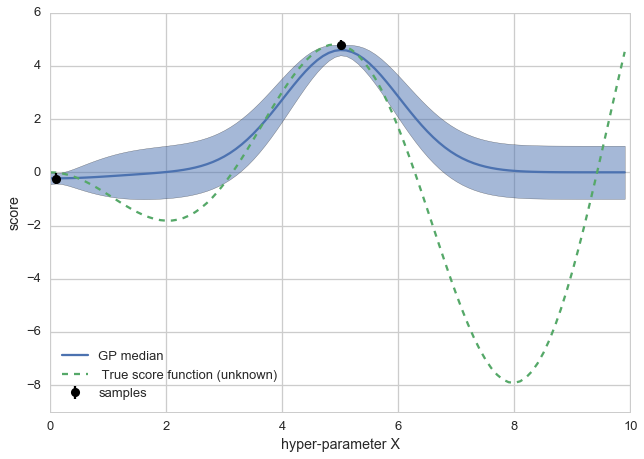
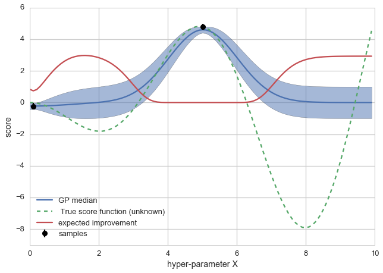
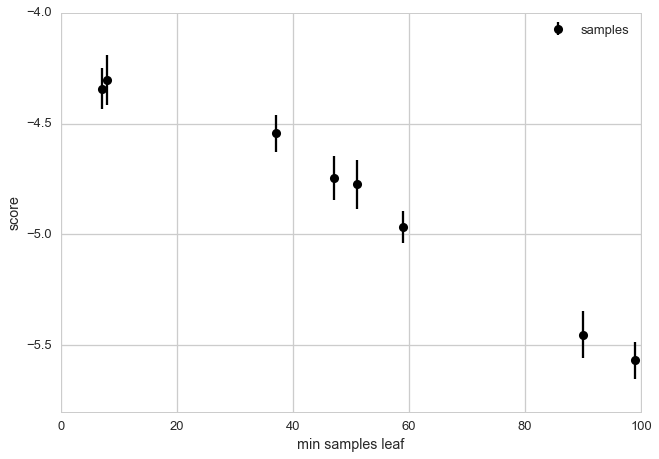
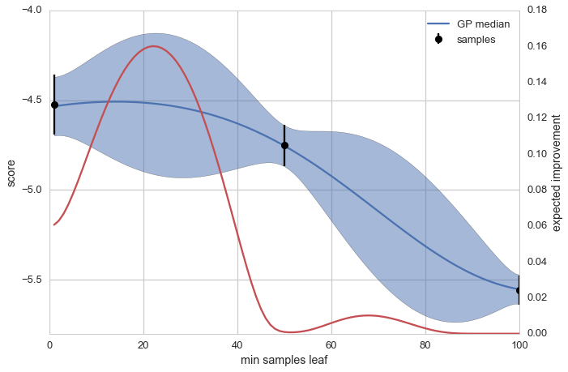
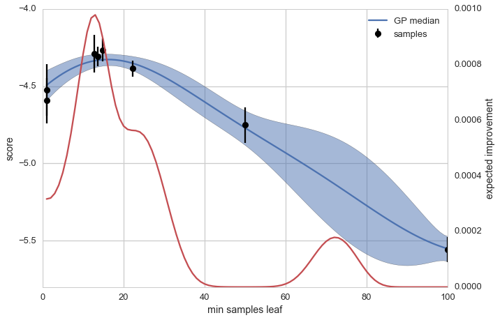

---
layout: post
title: 较小超参数的Bayesian optimisation
category: 翻译
tags: [python  ,bayesian]


># 较小超参数的Bayesian optimisation

   在拟合一个单分类器时不需要花费太多时间，但是在拟合上百个分类器时却需要大量时间。在寻找超参数时我们必须要拟合多个分类器，那我们应该怎么解决这种问题呢？

本文研究了Bayesian optimisation的算法的内部工作，你可以通过使用它来减少设定的超参数集的数量并获得最优的超参数集。如果你正在寻找一个已经实现的算法工具，[Yelp](http://www.yelp.com/la-crescenta-montrose-ca-us)提供了 [MOE](https://github.com/Yelp/MOE), [metric optimisation](https://github.com/Yelp/MOE) 

通常高斯过程回归是一个有效的工具同时被大量使用在这里。如果想获得关于高斯过程回归更多的信息可以参考[Gaussian processes with george](http://betatim.github.io/posts/gaussian-processes-with-george/)。

本文将从一个事前知道的得分方程的真实形式的案例开始，通过比较random grid search和Bayesian optimisation两种算法，来发现对于实际分类器的最优的超参数。


首先从安装和导入模块开始。


```python
#ruby -e "$(curl -fsSL https://raw.githubusercontent.com/Homebrew/install/master/install)"  
#http://brew.sh/index_zh-cn.html
#http://dan.iel.fm/george/current/user/quickstart/#installation
#brew install eigen
#pip install george
%matplotlib inline       #内嵌画图
```


```python
import random
import numpy as np
np.random.seed(9)

from scipy.stats import randint as sp_randint

import matplotlib.pyplot as plt

import seaborn as sns
sns.set_style('whitegrid')
sns.set_context("talk")
```

> # By George!

    Bayesian optimisation对之前超参数空间中的评估点使用高斯过程来拟合回归模型。同时这个模型将提供超参数空间中下一个用于评估模型的点（可能是最优的）。
    
    
    为了选择最优的点我们需要定义一个准则，在这种情况下我们使用“提高期望”的准则。就像我们所知的那样，在一个有精准的得分函数下，我们并不想简单的选择获得最高分的点。相反我们选择那些在能最大增加期望的点。这种方法允许我们将得分方程的不确定性纳入流程，并引导参数空间的搜索。
    
    
    下面我们设置一个得分函数(-x sin x)，从中抽取两个点，并拟合我们的高斯过程模型。


```python
import george
from george.kernels import ExpSquaredKernel

score_func = lambda x: -x*np.sin(x)
x = np.arange(0, 10, 0.1)
```


```python
# Generate some fake, noisy data. These represent
# the points in hyper-parameter space for which
# we already trained our classifier and evaluated its score
xp = 10 * np.sort(np.random.rand(2))
yerr = 0.2 * np.ones_like(xp)
yp = score_func(xp) + yerr * np.random.randn(len(xp))
```


```python
# Set up a Gaussian process
kernel = ExpSquaredKernel(1)
gp = george.GP(kernel)

gp.compute(xp, yerr)

mu, cov = gp.predict(yp, x)
std = np.sqrt(np.diag(cov))


def basic_plot():
    fig, ax = plt.subplots()
    ax.plot(x, mu, label="GP median")
    ax.fill_between(x, mu-std, mu+std, alpha=0.5)
    ax.plot(x, score_func(x), '--', label=" True score function (unknown)")
    # explicit zorder to draw points and errorbars on top of everything
    ax.errorbar(xp, yp, yerr=yerr, fmt='ok', zorder=3, label="samples")
    ax.set_ylim(-9,6)
    ax.set_ylabel("score")
    ax.set_xlabel('hyper-parameter X')
    ax.legend(loc='best')
    return fig,ax
basic_plot()
```


    (<matplotlib.figure.Figure at 0x109dd82d0>,
     <matplotlib.axes._subplots.AxesSubplot at 0x10b945590>)





其中绿色虚线代表得分函数（以超参数X为函数）的真实值。图中黑的的点（以及他们的误差线）是我们用于评估分类器的点同时我们也计算出其得分。在蓝色线是我们利用回归模型所试图预测的得分函数，并用深蓝色阴影区域代表得分函数值的不确定性。

下面我们计算在超参数X每个位置的提高的期望。我们也建立了一个多点优化程序（next_sample），它通过使用提高期望的方法来选择哪个点将在下一步中使用。


```python
from scipy.optimize import minimize
from scipy import stats
```


```python
def expected_improvement(points, gp, samples, bigger_better=False):
    # are we trying to maximise a score or minimise an error?
    if bigger_better:
        best_sample = samples[np.argmax(samples)]

        mu, cov = gp.predict(samples, points)
        sigma = np.sqrt(cov.diagonal())

        Z = (mu-best_sample)/sigma

        ei = ((mu-best_sample) * stats.norm.cdf(Z) + sigma*stats.norm.pdf(Z))

        # want to use this as objective function in a minimiser so multiply by -1
        return -ei
    
    else:
        best_sample = samples[np.argmin(samples)]

        mu, cov = gp.predict(samples, points)
        sigma = np.sqrt(cov.diagonal())

        Z = (best_sample-mu)/sigma

        ei = ((best_sample-mu) * stats.norm.cdf(Z) + sigma*stats.norm.pdf(Z))

        # want to use this as objective function in a minimiser so multiply by -1
        return -ei

def next_sample(gp, samples, bounds=(0,10), bigger_better=False):
    """Find point with largest expected improvement"""
    best_x = None
    best_ei = 0
    # EI is zero at most values -> often get trapped
    # in a local maximum -> multistarting to increase
    # our chances to find the global maximum
    for rand_x in np.random.uniform(bounds[0], bounds[1], size=30):
        res = minimize(expected_improvement, rand_x,
                       bounds=[bounds],
                       method='L-BFGS-B',
                       args=(gp, samples, bigger_better))
        if res.fun < best_ei:
            best_ei = res.fun
            best_x = res.x[0]
            
    return best_x


fig, ax = basic_plot()
# expected improvement would need its own y axis, so just multiply by ten
ax.plot(x, 10*np.abs(expected_improvement(x, gp, yp)),
        label='expected improvement')
ax.legend(loc='best')
```


    <matplotlib.legend.Legend at 0x109de4490>





```python
print "The algorithm suggests sampling at X=%.4f"%(next_sample(gp, yp))
```

    The algorithm suggests sampling at X=1.5833


其中红色的线代表期望的提高。通过对比蓝色实心线和阴影区域，优化算法建议将期望提高最大的点X=1.58作为下一个点来计算我们的得分函数。

现在让我们看看一些实际的案例。

># 以随机格点搜索的效果作为基准


为了让这个简单的示例更有趣，我们使用一个来自(Friedman1)的回归问题以及一个决策树回归模型（它在这个数据集下面拟合大量分类器相当的快）。你可以在实际问题中用它来代替两者。


为了评估在搜索超参数中谁比较快，我们将对bayesian optimisation和 随机格点法进行对比。随机格点搜索法已经比枚举的格点法提升了很多。我通过一个来自[Gilles Louppe's](http://twitter.com/glouppe)的博士论文[Understanding Random Forests: From Theory to Practice](http://orbi.ulg.ac.be/handle/2268/170309)的特殊回归问题来做实验。


```python
from sklearn.grid_search import GridSearchCV
from sklearn.grid_search import RandomizedSearchCV
from sklearn.datasets import make_friedman1
from sklearn.tree import DecisionTreeRegressor

from operator import itemgetter


# Load the data
X, y = make_friedman1(n_samples=5000)


clf = DecisionTreeRegressor()

param_dist = {"min_samples_split": sp_randint(1, 101),
             }

# run randomized search
n_iterations = 8

random_grid = RandomizedSearchCV(clf,
                                 param_distributions=param_dist,
                                 n_iter=n_iterations,
                                 scoring='mean_squared_error')
random_grid = random_grid.fit(X, y)
```


```python
from scipy.stats import sem

params_ = []
scores_ = []
yerr_ = []
for g in random_grid.grid_scores_:
    params_.append(g.parameters.values()[0])
    scores_.append(g.mean_validation_score)
    yerr_.append(sem(g.cv_validation_scores))

fig, ax = plt.subplots()
ax.errorbar(params_, scores_, yerr=yerr_, fmt='ok', label='samples')
ax.set_ylabel("score")
ax.set_xlabel('min samples leaf')
ax.legend(loc='best')
```


    <matplotlib.legend.Legend at 0x10a52ebd0>





```python
def top_parameters(random_grid_cv):
    top_score = sorted(random_grid_cv.grid_scores_,
                       key=itemgetter(1),
                       reverse=True)[0]
    print "Mean validation score: {0:.3f} +- {1:.3f}".format(
        top_score.mean_validation_score,
        np.std(top_score.cv_validation_scores))
    print random_grid_cv.best_params_
    
top_parameters(random_grid)
```

    Mean validation score: -4.304 +- 0.161
    {'min_samples_split': 8}


 最大的得分参数大概在8附近。现在让我们来试试bayesian方法。

># Bayesian optimisation

   你已经准备好你的先验函数了么？让我开始用bayesian的方法来试一下！那么问题就是我们是否可以找到和 min_smples_split至少一样的值或者更好的一个或者减少计算步骤。


首先我们使用在拟合高斯过程模型中的三个点来评估模型。而下一个点我们将采用能让期望增加最大的点。


下面两个图展现了Bayesian optimisation在使用之前三个点，并且依据提高期望的准则，又纳入了5个点后的情形


```python
from sklearn.cross_validation import cross_val_score

def plot_optimisation(gp, x, params, scores, yerr):
    mu, cov = gp.predict(scores, x)
    std = np.sqrt(np.diag(cov))

    fig, ax = plt.subplots()
    ax.plot(x, mu, label="GP median")
    ax.fill_between(x, mu-std, mu+std, alpha=0.5)

    ax_r = ax.twinx()
    ax_r.grid(False)
    ax_r.plot(x,
              np.abs(expected_improvement(x, gp, scores, bigger_better=True)),
              label='expected improvement',
              c=sns.color_palette()[2])
    ax_r.set_ylabel("expected improvement")
    
    # explicit zorder to draw points and errorbars on top of everything
    ax.errorbar(params, scores, yerr=yerr,
                fmt='ok', zorder=3, label='samples')
    ax.set_ylabel("score")
    ax.set_xlabel('min samples leaf')
    ax.legend(loc='best')
    return gp

def bayes_optimise(clf, X,y, parameter, n_iterations, bounds):
    x = range(bounds[0], bounds[1]+1)
    
    params = []
    scores = []
    yerr = []
    
    for param in np.linspace(bounds[0], bounds[1], 3, dtype=int):
        clf.set_params(**{parameter: param})
        cv_scores = cross_val_score(clf, X,y, scoring='mean_squared_error')
        params.append(param)
        scores.append(np.mean(cv_scores))
        yerr.append(sem(cv_scores))
    
    # Some cheating here, tuning the GP hyperparameters is something
    # we skip in this post
    kernel = ExpSquaredKernel(1000)
    gp = george.GP(kernel, mean=np.mean(scores))
    gp.compute(params, yerr)
    
    plot_optimisation(gp, x, params, scores, yerr)
        
    for n in range(n_iterations-3):
        gp.compute(params, yerr)
        param = next_sample(gp, scores, bounds=bounds, bigger_better=True)
        
        clf.set_params(**{parameter: param})
        cv_scores = cross_val_score(clf, X,y, scoring='mean_squared_error')
        params.append(param)
        scores.append(np.mean(cv_scores))
        yerr.append(sem(cv_scores))
        
    plot_optimisation(gp, x, params, scores, yerr)
    return params, scores, yerr, clf

params, scores, yerr, clf = bayes_optimise(DecisionTreeRegressor(),
                                           X,y,
                                           'min_samples_split',
                                           8, (1,100))
```








```python
print "Best parameter:"
print params[np.argmax(scores)], 'scores', scores[np.argmax(scores)]
```

    Best parameter:
    14.8626450189 scores -4.26649894389


你可以看到通过抽样所得的点都非常接近最大值。当随机格点搜索法抽样到的点远离最高点的区域时（40或者以上），baiyesian optimization方法所抽得的点集中于最大值附近（大约20左右）。这样快速有效的找到最大值。有时候我们甚至可以提前停止计算后续的五个点，因为他们都十分接近彼此。

># 利器--MOE

     
   虽然它很容易为你自己建立一个小的bayesian optimisation过程,我依然建议你看看[MOE](https://github.com/Yelp/MOE)。它是一个用于做全局，黑箱优化的一个非常优秀的产品，由Yelp的专业学者们开发，因此比我们自己做的方案更加强大。
     
     

> # 结论
   
   bayesian optimisation并不可怕，通过两个例子，我们可以相信通过使用像这样的聪明方法可以获得比格点搜索法更快的解决问题（即使在高维的情况下），但实际上并没有任何魔法发生。
